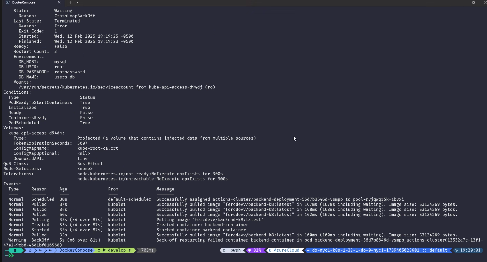
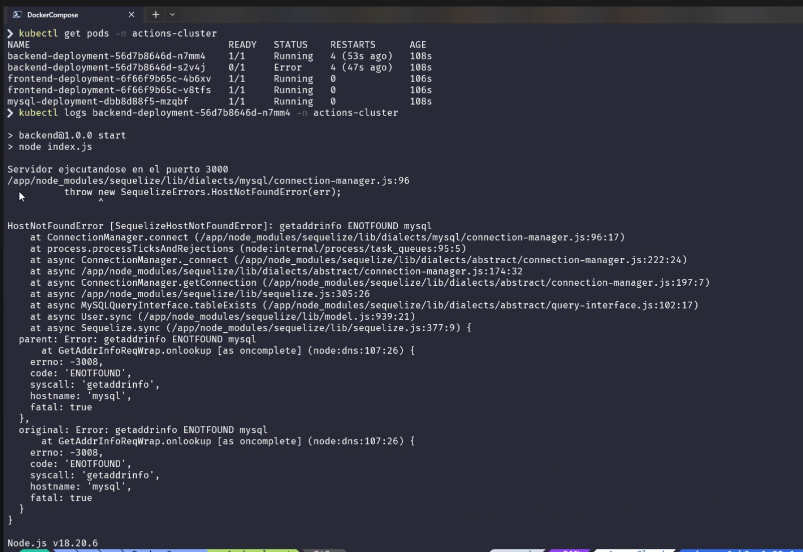
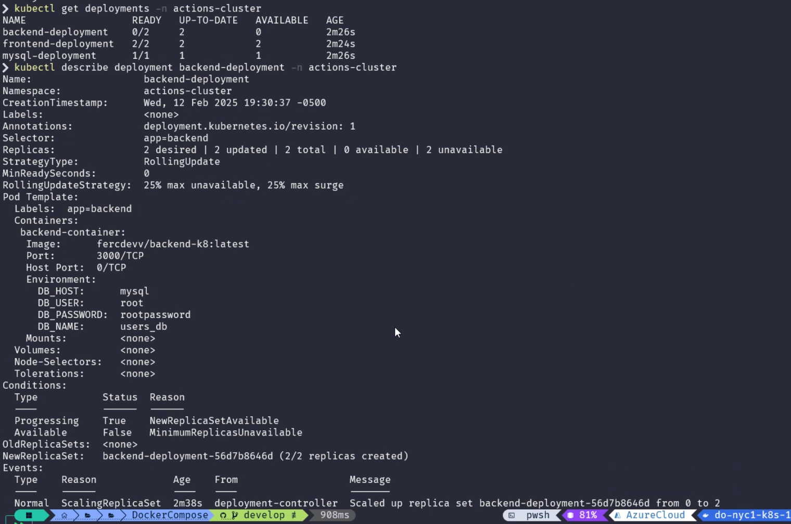
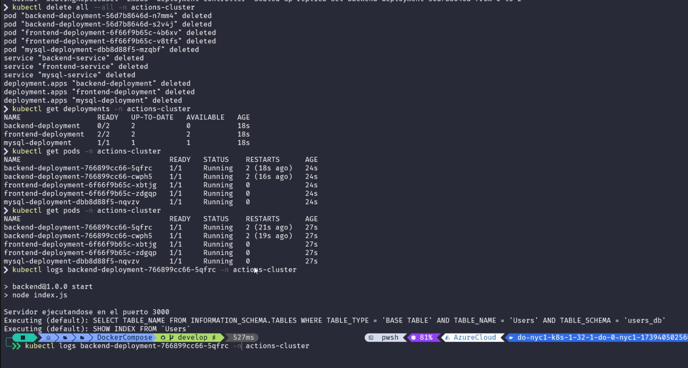

commandos : 

 kubectl get svc -n actions-cluster-jesusramirez
actualizar imagen 

❯ kubectl rollout restart deployment frontend-deployment -n actions-cluster-jesusramirez
❯ kubectl rollout restart deployment backend-deployment -n actions-cluster-jesusramirez